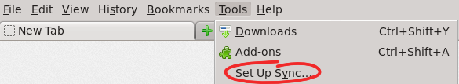
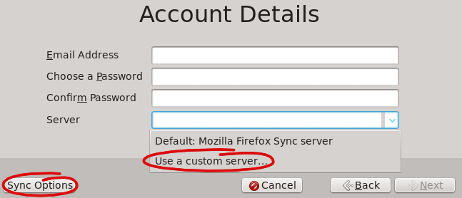

Changing your Mozilla Sync installation
=======================================

### Content
1. <a href="#install">Install</a>
    1. <a href="#app-installation">App installation</a>
    2. <a href="#sync-installation-on-desktop-firefox">Sync installation on desktop Firefox</a>
    3. <a href="#add-sync-devices">Add sync devices</a>
    4. <a href="#troubleshooting">Troubleshooting</a>
2. <a href="#uninstall">Uninstall</a>
3. <a href="#reinstall">Reinstall</a>
4. <a href="#upgrade">Upgrade</a>

Install
-------

### App installation
You can either install the stable release version or the development version:

* Stable: [apps.owncloud.com](http://apps.owncloud.com/content/show.php?content=161793)
* Development: Clone [GitHub repository](https://github.com/owncloud/mozilla_sync/) or download [ZIP file of the master branch](https://github.com/owncloud/mozilla_sync/archive/master.zip)

The installation procedure is as follows:

1. Move the resulting ````mozilla_sync```` folder to your ownCloud's apps directory.
2. Enable it in the web interface's admin panel.
3. Set an email address for all users that want to use Mozilla Sync. If the user name is already an email address (e.g. **external_user** app) it will be set automatically when users visit their personal page after installing Mozilla Sync. Note: **Email addresses must be unique!**

### Sync installation on desktop Firefox

**IMPORTANT:** If you are using Firefox > 29 you need to do this steps befor you can continue with original instructions:

1. Browse to ````about:config```` and press Yes,...

2. Add a new string named
        **services.sync.tokenServerURI**

3. Fill it with your URL looks like ````http://YOURCLOUDDOMAIN/remote.php/mozilla_sync/````

4. Add a new string named
        **services.sync.username**

5. Fill it with something other than your Username e.g. blablubb

6. Restart Firefox and continue with below instructions.


To init the sync of bookmarks, etc. you have to create an account with a desktop installation of Firefox. If you want to sync other devices (e.q. smart phones) do the following installation steps and than pair your device.

1. Start the sync configuration process

    via the *settings* > *Sync* > *Set Up Firefox Sync*<br/>
    <a href="" target="_blank"></a>
    
    or via *Tools* > *Set Up Sync...*<br/>
    <a href="" target="_blank"></a>
    
2. A new window opens where you see this:

    <a href="" target="_blank"></a>
    
    You choose "Create a New Account".
    
3. In the next form you have to type in your personal data.

    <a href="" target="_blank"></a>
    
    First, you should choose "Use a custom server..." and type in the URL given in the personal settings of your owncloud account (something like ```http(s)://<owncloud-server>/remote.php/mozilla_sync/```). Then you add the email address and password of your owncloud account.
    
4. With the button "Sync Options" the dialog switchs to the options.

    <a href="" target="_blank"></a>
    
    Here you choose a name for the device you want to sync and choose which data should be synced.
    
5. After finishing the "Account Details" dialog and everything was okay, you see a new tab telling you that the setup is completed and that Firefox is syncing now (which you could see at the progress bar).

### Add sync devices
Additional clients can be added manually or with Mozilla's device pairing service. More informations about that you find read at <a href="http://mzl.la/KpeZJw">mozilla support: How do I set up Firefox Sync?</a>.

### Troubleshooting
Tips and tricks helping you with Firefox sync could be found at <a href="http://mzl.la/MHqQXd">mozilla support: Firefox Sync troubleshooting and tips</a>.


Uninstall
---------

To completely uninstall Mozilla Sync, *deactivate/uninstall* it in your ownCloud's admin panel (**attention!** this will delete the ```mozilla_sync``` directory, so maybe make a backup first).

Then, drop the following tables in your database:

* ```oc_mozilla_sync_collections```
* ```oc_mozilla_sync_users```
* ```oc_mozilla_sync_wbo```

Finally, delete all four entries related to the app from the ```oc_appconfig``` table by executing the following SQL statement:

```
DELETE FROM oc_appconfig WHERE oc_appconfig.appid = 'mozilla_sync' AND oc_appconfig.configkey = 'types';
DELETE FROM oc_appconfig WHERE oc_appconfig.appid = 'core' AND oc_appconfig.configkey = 'remote_mozilla_sync';
DELETE FROM oc_appconfig WHERE oc_appconfig.appid = 'mozilla_sync' AND oc_appconfig.configkey = 'installed_version';
DELETE FROM oc_appconfig WHERE oc_appconfig.appid = 'mozilla_sync' AND oc_appconfig.configkey = 'enabled';
```

Now you have completely removed Mozilla Sync and are free to do a clean reinstall of the app.

Reinstall
---------

To reinstall the app you can first follow the **Uninstall** and then the **Install** sections.

Upgrade
-------

If you want to upgrade the Mozilla Sync app you can just replace the ```apps/mozilla_sync/``` folder with a newer version.
