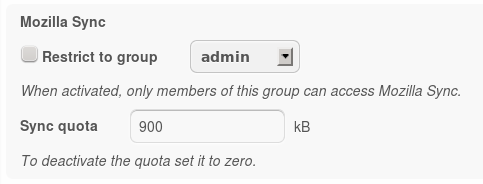

Admin Manual
============

The admin settings for the Mozilla Sync app look like this:

There are two settings:

1. *Restrict to group* controls the access to the Mozilla Sync app.
2. *Sync quota* limits the data that can be stored on the server per user.
