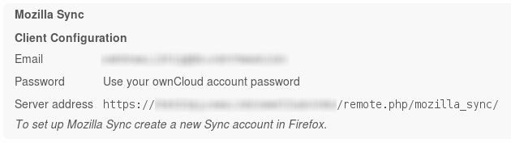
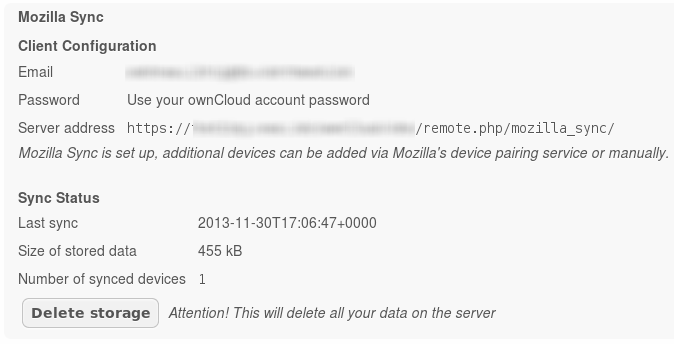

User manual
===========

Before sync set up
------------------
Looking to your personal settings in ownCloud will show this:

Here you could see your client config data which has to be typed in while settings up your sync first time.

After sync set up
-----------------
If you finished the set up, you get this:

The new section "Sync Status" shows that the set up succeeded and further some data.
Besides the infos you get the "Delete storage" button, which removes all your data from the server. But, whatch your step! Deleting all the data will not inform your browser/devices, so they will be confused without further instructions.